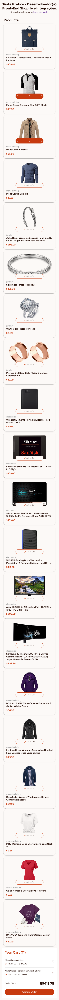

# Product List with Cart

## 📌 Sobre o Projeto
Este projeto é uma **lista de produtos com carrinho de compras**, desenvolvido utilizando **HTML, CSS e JavaScript**. Foi um **teste prático** solicitado pela empresa **Figi**.

Os dados dos produtos foram consumidos a partir da **API Fake Store**: [https://fakestoreapi.com](https://fakestoreapi.com). 

O projeto conta com as seguintes funcionalidades:
- Listagem dinâmica de produtos vindos da API
- Adição e remoção de produtos do carrinho
- Atualização da quantidade de produtos no carrinho
- Exibição do total do pedido
- Skeleton loader para melhor experiência de carregamento
- Design responsivo para diferentes dispositivos

O deploy do projeto foi realizado utilizando **GitHub Pages** e pode ser acessado em:
👉 [Página do Projeto](https://lucazevedos.github.io/teste-pratico-Figi)

O código-fonte está disponível no GitHub:
👉 [Repositório no GitHub](https://github.com/lucazevedos/teste-pratico-Figi)

---

## 🚀 Tecnologias Utilizadas
- **HTML5**: Estruturação da página
- **CSS3**: Estilização e responsividade
- **JavaScript (ES6+)**: Manipulação do DOM e consumo da API
- **Fake Store API**: Fornecimento dos produtos
- **GitHub Pages**: Hospedagem do projeto

---

## 📷 Captura de Tela
### 📌 Versão Desktop


### 📌 Versão Mobile


---

## 📂 Estrutura do Projeto
```
📦 Figi
├── 📁 assets          # Arquivos estáticos
├── 📁 scripts         # Scripts JavaScript
│   ├── addCart.js
│   ├── getCart.js
│   ├── index.js
│   ├── products.js
├── 📁 stylesheets     # Arquivos CSS
│   ├── skeleton.css
│   ├── style.css
├── 📁 design          # Design de referência
├── .gitignore         # Arquivos ignorados no Git
├── data.json          # Dados fictícios dos produtos
├── index.html         # Página principal
├── README.md          # Documentação do projeto
├── style-guide.md     # Guia de estilos
```

---

## 🔧 Como Executar o Projeto
### 1️⃣ Clonar o Repositório
```sh
git clone https://github.com/lucazevedos/teste-pratico-Figi.git
```

### 2️⃣ Abrir o Arquivo `index.html`
Basta abrir o arquivo `index.html` em qualquer navegador moderno.

### 3️⃣ Visualizar a Versão Online
Acesse a versão hospedada no **GitHub Pages** através do link:
👉 [Página do Projeto](https://lucazevedos.github.io/teste-pratico-Figi)

---

## 📌 Funcionalidades Implementadas
✅ Listagem dinâmica de produtos com consumo da API 
✅ Carrinho de compras funcional (adicionar/remover produtos, atualizar quantidade)
✅ Skeleton loader enquanto os produtos carregam
✅ Interface responsiva para desktop e mobile
✅ Exibição do valor total do pedido
✅ Deploy online via GitHub Pages

---

## 🎨 Estilização e Design
- O layout do projeto foi desenvolvido seguindo boas práticas de **UI/UX**.
- Utilizamos **CSS puro**, sem frameworks externos.
- A paleta de cores e fontes foram definidas para manter uma interface elegante e intuitiva.

---

## 📡 API Utilizada
A API utilizada foi a **Fake Store API**, que fornece dados fictícios de produtos.

🔗 [Documentação da API](https://fakestoreapi.com/docs)

Exemplo de requisição para obter os produtos:
```javascript
fetch('https://fakestoreapi.com/products')
  .then(res => res.json())
  .then(data => console.log(data));
```

---

## 🚀 Deploy no GitHub Pages
O projeto foi publicado usando **GitHub Pages**. Para fazer o deploy de um repositório próprio:
1. Vá para **Settings** no repositório do GitHub
2. Role até a seção **GitHub Pages**
3. Selecione a branch `main` e clique em **Save**
4. O link do projeto será gerado automaticamente

---

## 👨‍💻 Autor
- **Lucas Azevedo**
- 💼 [LinkedIn](https://www.linkedin.com/in/lucas-azeved/)

Se gostou do projeto, deixe uma ⭐ no repositório!

🚀 Feito com dedicação para o teste da **Figi**. 

